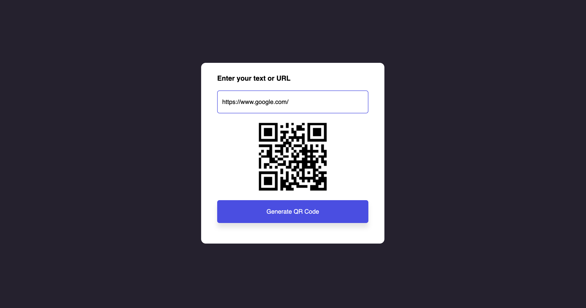

# QR Code Generator

A simple web-based QR Code Generator that allows users to create QR codes for any text or URL. This project is built using HTML, CSS, and JavaScript and provides a clean and responsive interface for generating QR codes.

---

## 🌐 Live Demo

Check out the live version of the project here: [Live Demo](https://qr-code-generator-three-snowy.vercel.app/)

---

## 🌟 Features

- **Generate QR Codes**:  
  Enter any text or URL, and the app generates a QR code instantly.

- **Responsive Design**:  
  The app is fully responsive and works seamlessly on both desktop and mobile devices.

- **Error Handling**:  
  Alerts the user if the input field is empty by shaking the input box.

- **Smooth Animations**:  
  The QR code image box expands smoothly when a QR code is generated.

---

## 📸 Screenshots

### Input Field and Button

### Generated QR 

---

## 📖 How It Works

1. Enter any text or URL in the input field.
2. Click the "Generate QR Code" button.
3. The QR code will be displayed in the center of the image box.

---

## 🛠️ Technologies Used

- **HTML5**: For structuring the web page.
- **CSS3**: For styling and creating a responsive design.
- **JavaScript (ES6)**: For interactivity and dynamic QR code generation.
- **QR Code API**: [GoQR API](https://goqr.me/api/) is used to generate QR codes.

---

## 📂 Project Structure

QR Code Generator/ │ ├── index.html # Main HTML file ├── style.css # CSS file for styling ├── script.js # JavaScript file for functionality ├── images/ # Folder for screenshots and other images └── README.md # Documentation file

---

## 🚀 How to Run the Project

1. Clone or download the project files to your local machine.
2. Open the `index.html` file in any modern web browser.
3. Enter text or a URL in the input field and click "Generate QR Code" to see the result.

---

## 📈 Future Enhancements

- Add a feature to download the generated QR code as an image.
- Allow users to customize the size and color of the QR code.
- Add support for different QR code formats (e.g., vCard, Wi-Fi, etc.).
- Include a dark mode toggle for better user experience.

---

## 📝 License

This project is open-source and available under the [MIT License](LICENSE).

---

## 👨‍💻 About the Developer

Hi, I'm Aryan Raj, a passionate web developer with a focus on creating interactive and user-friendly web applications. Feel free to connect with me on [LinkedIn](#) or check out my other projects on [GitHub](#).
